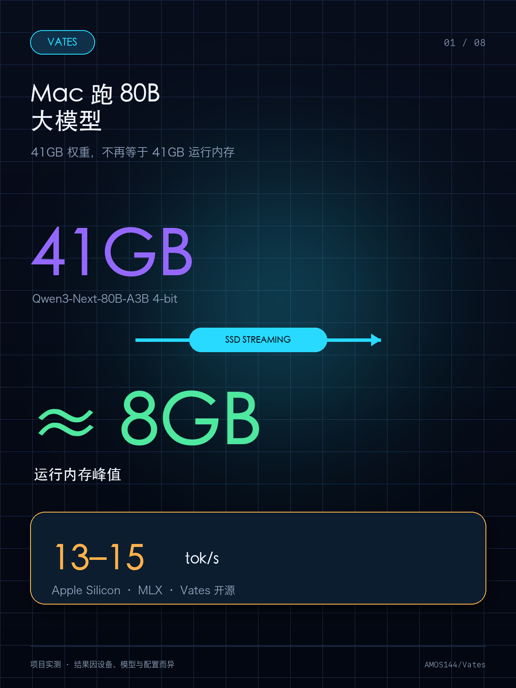
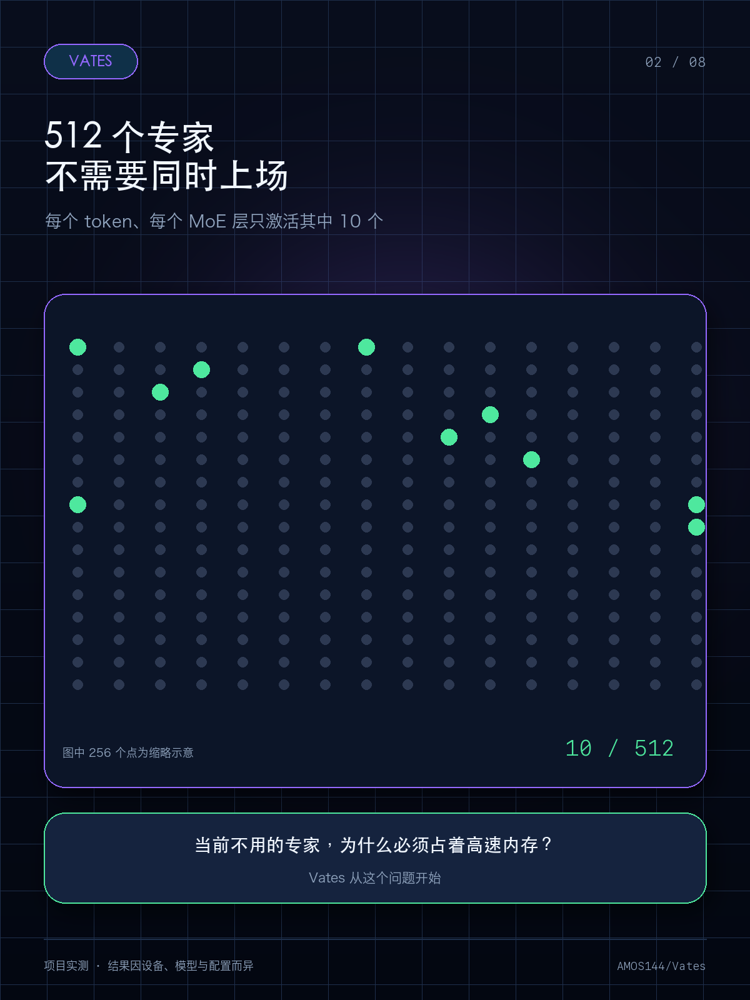
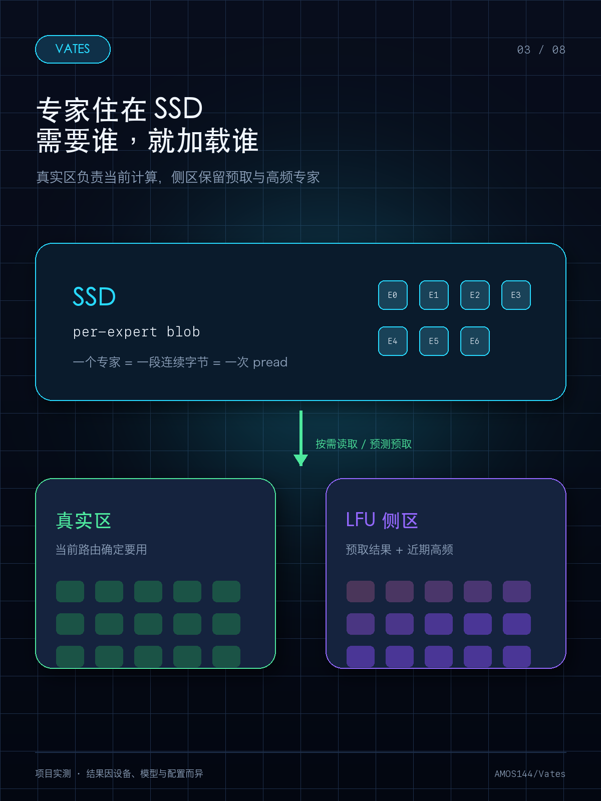
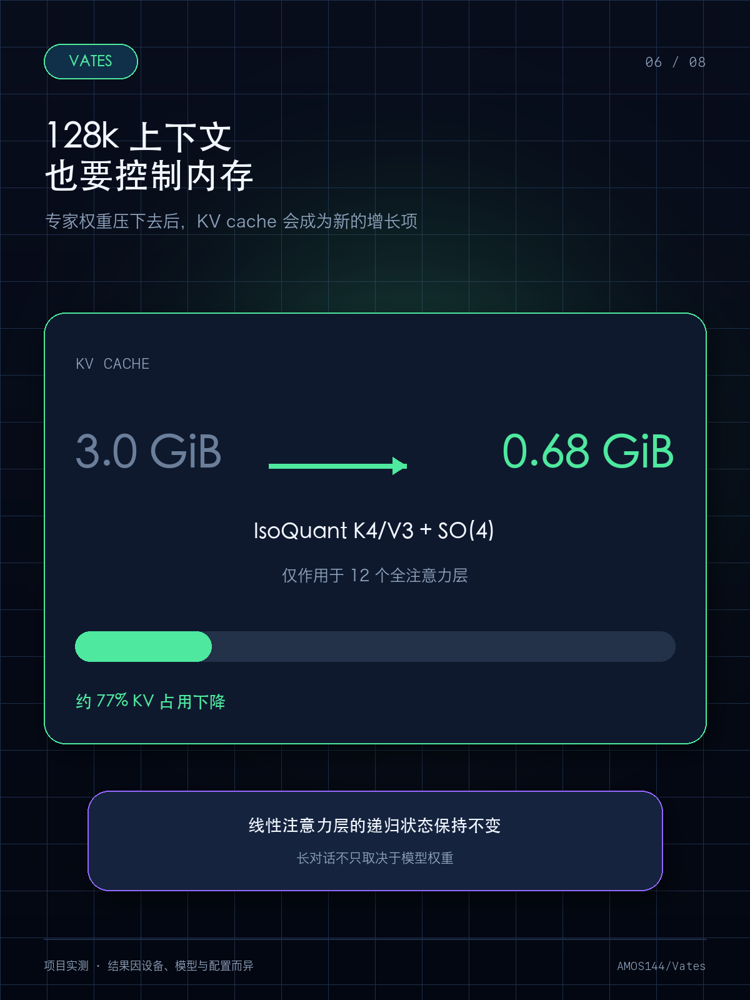
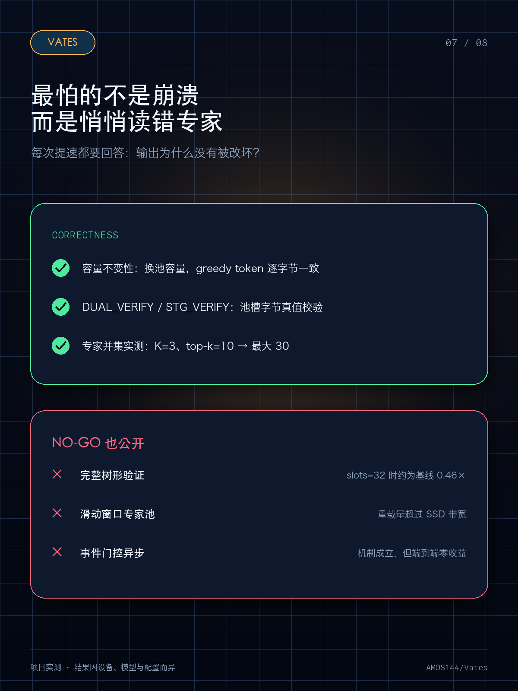

# Mac 跑 80B 大模型，我把运行内存压到了约 8 GB

> 项目实测，结果因设备、模型和配置而异。

80B MoE 模型的 4-bit 权重约 41 GB，普通加载方式很容易撞上 Mac 的统一内存上限。

但我发现：它虽然有 512 个专家，每个 token 在每个 MoE 层真正激活的只有 10 个。于是我做了一个有点“反常规”的方案——**不让全部专家一直待在内存里。**

💻 我开源了 **Vates**，一套面向 Apple Silicon 和 MLX 的流式 MoE 推理引擎。

可以把它理解成：

> 512 个专家平时住在 SSD，需要谁时才让谁上班；系统还会把当前隐藏状态提前送进未来层的 gate，预测专家候选，并让 C++ 趁中间层计算时异步读盘。

这样，约 41 GB 的完整权重不再等于约 41 GB 的运行内存。当前生产配置实测：

- 🧠 运行内存峰值约 **8 GB**
- ⚡ 生成速度约 **13–15 tok/s**
- 📚 128k 上下文 KV：约 **3.0 GiB → 0.68 GiB**

为了不让磁盘读取把速度拖垮，我做了几件事：

1. 用一个小型专家池缓存当前需要和近期高频的专家；
2. 用未来层自己的 gate 选出 24 个候选，过滤常驻专家后，再由 C++ 异步 `pread`；
3. 把按需读取、缓存驱逐和池状态下沉到 C++；
4. 使用 Qwen3-Next 自带的 MTP 头做自投机解码。

性能之外，我还专门做了容量不变性和逐字节真值校验。因为这类系统最可怕的 Bug 不是崩溃，而是“看起来正常，却悄悄读错了专家”。

预测没命中或没有及时到位时，系统仍会走按需读取路径，不改变模型真实路由。

项目里也保留了失败实验：有些方案名字很酷，比如完整树形验证、滑动窗口专家池，但实测反而更慢，所以没有放进生产路径。做推理系统，最终还是要看数据。

🎬 Vates 自带全屏 TUI，可以实时看到 token/s 和内存占用，也能用 `--demo` 在不加载模型时预览界面。

需要说明：

- 目前只支持 Apple Silicon + MLX；
- 仓库不包含模型权重，需要自行准备兼容的 Qwen3-Next-80B-A3B 4-bit MLX 模型、专家数据和 MTP 权重；
- 这仍是偏工程与研究性质的项目，不是一键安装应用；
- 约 8 GB 是当前配置的项目实测峰值，设备仍需为系统和其他组件预留额外统一内存；
- 实际速度和内存会受到芯片、SSD、上下文和配置影响。
- 各项优化收益来自独立实验，不能直接相加。

项目已经以 Apache-2.0 协议开源。

想看演示或研究实现，可以在 GitHub 搜索：

**AMOS144/Vates**

如果你也在用 Mac 折腾本地大模型，欢迎告诉我你的设备和关注的问题。觉得这个方向有意思，也欢迎点一个 Star ⭐

后续我也会继续公开真实测试数据和没有成功的实验，方便大家一起判断哪些优化真正有效。

---

## 备用标题

1. 41 GB 的 80B 模型，为什么运行时只用了约 8 GB？
2. 512 个专家住在 SSD：我做了一个 Mac 本地 80B 推理项目
3. 没想到 SSD 也能“喂”大模型：我的 80B MoE 项目开源了
4. 不把模型全塞进内存，Mac 也能挑战 80B MoE
5. Apple Silicon 跑 80B：约 8 GB 峰值背后的流式专家池

## 发布配图（按顺序上传）

1. 41 GB 权重到约 8 GB 运行峰值



2. MoE 每层只激活 10/512 个专家



3. 专家常驻 SSD、按需进入双源专家池



4. 未来层 gate、24 个候选与 C++ 异步 `pread`


5. 约 8 GB 峰值与 13–15 tok/s


6. 128k 上下文 KV 压缩



7. 正确性校验与 NO-GO 实验



8. Vates 开源与 GitHub 搜索入口


图片可重复生成：

```bash
uv run --with pillow python docs/marketing/assets/generate_xiaohongshu_images.py
```

## 小红书标签

#Mac大模型 #本地大模型 #AppleSilicon #MLX #大语言模型 #MoE #AI开发 #模型推理 #开源项目 #程序员

## 置顶评论

项目地址在 GitHub 搜索 **AMOS144/Vates**。仓库里有演示视频、安装步骤、完整基准报告和被否决方案的记录。当前只支持 Apple Silicon + MLX，模型权重需要自行准备；欢迎留言设备型号和想看的实测方向。
